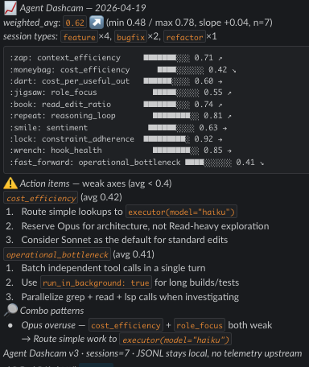

# Agent Dashcam

[English](./README.md) · [한국어](./README.ko.md)

> **A 10-axis session scorer and environment-update radar for coding agents.**
> Stop guessing why your session burned 500k tokens. Watch the tape.

Agent Dashcam turns every coding-agent session into structured telemetry — then refuses to let the LLM grade its own homework. Python scores, Node hooks brief, humans act.

Supports [Claude Code](https://claude.com/claude-code), [Codex CLI](https://github.com/openai/codex-cli), and [Gemini CLI](https://github.com/google-gemini/gemini-cli) — `agent-dashcam score --input <jsonl>` auto-detects the provider, and per-provider stop-hook wrappers (`hooks/{session,codex,gemini}-stop.mjs`) wire into each CLI's native hook manifest. The 10 axes are vendor-neutral; three heuristics (`read_edit_ratio`, `count_useful_outputs`, session-type classification) still key off Claude PascalCase tool names and fall back to neutral on Codex / Gemini until the next phase lifts them onto canonical tool families. See [`docs/ARCHITECTURE.md`](./docs/ARCHITECTURE.md) and [`CHANGELOG.md`](./CHANGELOG.md).

---

## Why "Agent Dashcam"?

A dashcam doesn't stop the car. It records. You only watch the tape when something went wrong — a collision, a near-miss, a suspiciously high bill at the shop.

LLM coding sessions need the same thing. You don't notice the session that burned $50 in reasoning loops until the invoice arrives. You don't notice the skill that started silently routing everything to Opus until your rate-limit alarms go off. **The footage is already there** — Claude Code, Codex, and Gemini all emit session JSONL. Agent Dashcam reads the tape, grades it by deterministic rules, and surfaces one actionable tip on your next session start.

| Dashcam on a car | Agent Dashcam on an agent |
|---|---|
| Records continuously, non-invasive | Reads session JSONL that already exists |
| Numbers don't lie (speed, GPS, timestamps) | 10 deterministic axes in `[0, 1]` |
| Driver can't gaslight the insurance — there's tape | LLM can't grade its own work — there's tape |
| You only watch when something went wrong | Briefing only surfaces on regression or anomaly |
| Footage stays with the driver | JSONL stays local; no telemetry upstream |

**The rule: the thing being measured does not get to score.** LLM self-evaluation drifts optimistic; deterministic Python rules do not.

---

## What it measures — the 10 axes

Three groups, ten axes, each normalised to `[0, 1]`:

### Context / cost (4 axes)

| Axis | Meaning | Good when |
|---|---|---|
| `context_efficiency` | Tokens spent vs. useful output produced | Grep-first, Read-narrow |
| `cost_efficiency` | USD per 1k output tokens | Haiku for lookup, Sonnet for edit, Opus only for architecture |
| `cost_per_useful_output` | USD per (commit + PR + passing test) — DX Core 4 style | Ship something in the session |
| `role_focus` | Tool-distribution entropy (not everything is Read) | Delegate to executor / explore / architect agents |

### Interaction quality (3 axes, [lucemia](https://github.com/anthropics/claude-code/issues/42796) empirical)

| Axis | Meaning | Good when |
|---|---|---|
| `read_edit_ratio` | `reads / edits` — ideal 2–6 | Read 1–3 related functions before each edit |
| `reasoning_loop` | Self-retry language density ("let me try again", "simplest fix") per 1k tool calls | Plan before executing; one hypothesis at a time |
| `sentiment` | Positive : negative ratio of user messages | Clear requirements, fewer course corrections |

### Infrastructure health (3 axes)

| Axis | Meaning | Good when |
|---|---|---|
| `constraint_adherence` | Violations of stated rules (e.g. `--no-verify`) per tool call | Don't bypass hooks |
| `hook_health` | Hook error rate | `logs/hook-errors.log` is empty |
| `operational_bottleneck` | Serial vs. parallel tool-call ratio, background-task usage | Batch independent calls, background long builds |

Final score = weighted average, weights defined in `config.example.json`.

---

## Session auto-classification

Not every session should produce a commit. A pure refactor, a doc edit, a debug dive — each one has axes that are **naturally low by design**. Agent Dashcam classifies every session into one of 8 types and suppresses the axes that do not apply.

| Type | Detection heuristic | Naturally-low axes (suppressed) |
|---|---|---|
| `feature` | ≥1 commit or PR | — |
| `docs` | ≥80% of edits on `.md`/`.mdx` | `cost_per_useful_output`, `role_focus` |
| `explore` | Read-family tools ≥60%, ≤2 edits | `cost_per_useful_output`, `read_edit_ratio` |
| `refactor` | ≥3 edits, zero tests, zero commits, edit-heavy | `cost_per_useful_output`, `read_edit_ratio` |
| `bugfix` | Edits + test runs, no commits | — |
| `debug` | Debug keywords + Bash ≥3 + tests | `sentiment` |
| `meta` | ≥60% of edits on config/settings/yaml/toml | `cost_per_useful_output`, `role_focus` |
| `mixed` | Nothing matched | — |

**Suppression rule**: if ≥50% of the sessions in the reporting window suppress an axis, that axis is skipped in action items and combo detection. The scorer still records the raw score — you just do not get nagged for being naturally low.

---

## Combo patterns

Single-axis dips are noise. Paired dips are signal. Agent Dashcam looks for five combos:

| Combo | Trigger | Fix |
|---|---|---|
| Opus overuse | `cost_efficiency < 0.4` AND `role_focus < 0.4` | Route simple work to `executor(model="haiku")` |
| Analysis paralysis | `read_edit_ratio == 0` AND `cost_per_useful_output < 0.4` | Force Edit after every 3 Reads |
| Flailing | `reasoning_loop < 0.4` AND `sentiment < 0.4` | Run `/plan --consensus` first |
| Environment rot | `hook_health < 0.5` AND `constraint_adherence < 0.5` | Run `agent-dashcam envup` and patch hooks |
| Golden session | All 10 axes ≥ 0.6 AND weighted_avg ≥ 0.75 | Document the setup — it is reproducible |

---

## Architecture — 3 stages, 0 prompt pollution

```
┌──────────────┐   ┌────────────────┐   ┌──────────────┐
│  1. COLLECT  │ → │   2. SCORE     │ → │  3. BRIEF    │
│  Node hooks  │   │  Python stdlib │   │  Node hook   │
│  append      │   │  deterministic │   │  on next     │
│  JSONL       │   │  rule-based    │   │  session     │
└──────────────┘   └────────────────┘   └──────────────┘
  SessionStop          session-stop         SessionStart
     hook               runs scorer          hook surfaces
  (data only)        (runs once per       brief + tip
                      session, off           (in reminder
                      the hot path)          frame)
```

**The LLM never scores itself, and never writes into its own context what it thinks of itself.** The scorer is `agent_dashcam_score.py` (stdlib only, no LLM calls), the brief is a `<system-reminder>` block written on *next* session start.

---

## The 3-hook pattern

1. **During session** — your existing hooks append tool calls to the session JSONL. (Claude Code does this for you; Agent Dashcam reads it.)
2. **Session stop** — `hooks/session-stop.mjs` runs `scripts/agent_dashcam_score.py`, writes `scores/<project>__<session>.json`, zero output to the conversation.
3. **Session start** — `hooks/session-start.mjs` loads the 3 most recent scores for this project, emits a briefing into the next conversation's `additionalContext` (weighted_avg, lowest non-suppressed axes, trend arrow, single actionable tip).

Token cost on the hot path: **zero**. All scoring is out-of-band.

---

## What you get — morning Slack briefing

Run `agent-dashcam daily` (or cron it) and this lands in your DM:

<p align="center">
  
</p>

Weighted average with trend arrow, 10-axis bar chart, action items ranked by impact, and combo-pattern detection — all in one glance. No dashboards to open, no graphs to squint at.

---

## Install

### Option A — Ask your agent to do it

Paste this into Claude Code / Codex CLI / Gemini CLI and it will install Agent Dashcam for you:

> Install Agent Dashcam from `https://github.com/sanghun0724/agent-dashcam` into `~/.claude/agent-dashcam/` (clone or symlink), copy `config.example.json` to `config.json`, run `python3 scripts/install_hooks.py` to wire the hooks, then verify with `python3 -m unittest discover -s fixtures` and report the test count. Use the `AGENT_DASHCAM_ROOT` env var if I already have a different install path.

Your agent will handle the clone, symlink, hook wiring, and verification — and tell you if anything failed.

### Option B — Manual install

```bash
# 1. Clone this repo somewhere
git clone https://github.com/sanghun0724/agent-dashcam.git
cd agent-dashcam

# 2. Symlink or copy into ~/.claude/agent-dashcam/
ln -s "$PWD" ~/.claude/agent-dashcam
# (or: cp -R . ~/.claude/agent-dashcam)

# 3. Copy the config template
cp ~/.claude/agent-dashcam/config.example.json ~/.claude/agent-dashcam/config.json

# 4. Wire the hooks into Claude Code settings
python3 ~/.claude/agent-dashcam/scripts/install_hooks.py

# 5. Verify
python3 -m unittest discover -s ~/.claude/agent-dashcam/fixtures
# → Ran 122 tests in 0.6s … OK
```

> **Path note**: scripts default to `~/.claude/agent-dashcam/` as root. Override with `AGENT_DASHCAM_ROOT=/path/to/install` to point at a different location (works for both Python scripts and Node hooks).

---

## Usage

```bash
# Score a single session JSONL (auto-detects provider by path + first-line sniff)
agent-dashcam score --input /path/to/session.jsonl

# Force a specific provider adapter
agent-dashcam score --input /path/to/rollout.jsonl --provider codex
agent-dashcam score --input /path/to/session-<uuid>.json --provider gemini

# Generate today's daily report (markdown + Slack blocks payload)
agent-dashcam daily

# Run the environment-update impact analysis
agent-dashcam envup

# Re-calibrate cost thresholds from the last 30 sessions (p20/p80)
agent-dashcam calibrate

# Show current status
agent-dashcam status
```

Daily Slack DM payloads land in `reports/daily/daily-<date>.slack.json` — pipe to your favourite Slack MCP tool or webhook.

---

## Testing

```bash
python3 -m unittest discover -s fixtures
```

122 tests cover:

- All 10 axis calculations (unit tests with synthetic input)
- Session-type classifier (8 types + edge cases)
- Dynamic threshold calibration (p20/p80 quantile + insufficient-sample skip)
- Schema drift detection
- 10-axis integration on a 100-line fixture JSONL
- Weight-sum invariant
- Claude, Codex, and Gemini adapters + canonical event stream (tool-family map for all three providers, `load_session` dict shape, `iter_events` typing, malformed-line resilience, end-to-end `score_jsonl()` smoke across fixtures)
- CLI provider dispatch (`--provider {auto,claude,codex,gemini}` + path/first-line auto-detect + claude fallback)
- Codex + Gemini stop-hook wrappers (`node --check`, dry-run, end-to-end scoring through the right adapter)
- OpenAI (gpt-5 / gpt-5-codex / o1-mini / o4-mini) and Gemini (2.5-pro / 2.5-flash / 1.5-pro / 1.5-flash) pricing lookup

---

## Roadmap

- **Scorer tool-family awareness** — lift `compute_read_edit_ratio`, `count_useful_outputs`, and `classify_session_type` off raw Claude PascalCase strings and onto canonical families so Codex/Gemini sessions get full fidelity on all 10 axes.
- **SessionStart briefers for Codex/Gemini** — counterparts to the existing stop-hook wrappers that emit the next-session briefing via each CLI's native `SessionStart` channel.
- **OTel GenAI exporter** — canonical event stream → OTLP (`gen_ai.*` attributes) for Grafana / Honeycomb / Datadog dashboards without a vendor lock-in.
- PyPI package (`pip install agent-dashcam`)
- Optional PostHog / Prometheus pushers
- Per-skill attribution (which skill drove which score change)

---

## License

MIT. See [`LICENSE`](./LICENSE).

---

> *"If you can't measure it, you can't improve it."* — Peter Drucker
> *"If you let the LLM grade itself, the grade is always A."* — Agent Dashcam
